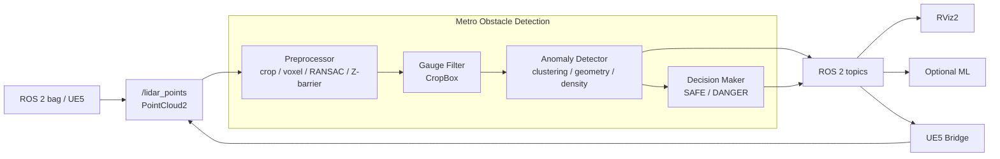
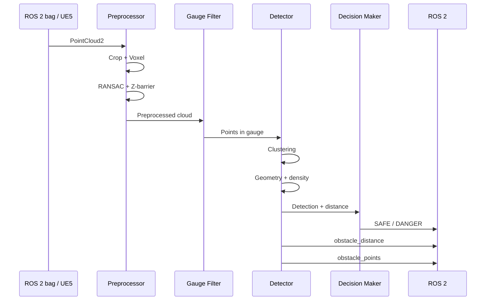

# Metro Obstacle Detection

## Навигация
- [Быстрый старт](#быстрый-старт)
- [Архитектура](#архитектура-системы)
- [Алгоритм](#алгоритм-обнаружения)
- [ROS 2 Interfaces](#ros-2-interfaces)
- [Конфигурация](#конфигурация)
- [Сборка](#сборка)
- [Запуск](#запуск)
- [Демонстрация](#демонстрация)
- [Тестирование](#тестирование)
- [RViz2](#rviz2)
- [Benchmark](#benchmark)
- [Эксперименты](#эксперименты)
- [Ограничения](#ограничения)
- [ML](#интеграция-с-ml-классификатором)
- [UE5](#ue5-bridge)
- [Структура](#структура-репозитория)
- [Соответствие ТЗ](#соответствие-тз)
- [Команда](#команда)

# Быстрый старт

```bash
# 1. Сборка GPU
docker build -t metro_obstacle:gpu ros2_ws/ --build-arg USE_CUDA=ON

# 2. Запуск bag
./ros2_ws/run.sh run data/for_hackathon/doubleT_obstacle

# 3. Тесты
./ros2_ws/run.sh test

# 4. RViz2
./ros2_ws/run.sh rviz data/new_data

# 5. Benchmark
./ros2_ws/benchmark.sh doubleT_obstacle
```

Результат: `SAFE / DANGER`, `/metro/obstacle_distance`, `/metro/obstacle_points`, `/metro/safety_status`.

# Архитектура системы

```text
ROS 2 bag / UE5
      ↓
/lidar_points (PointCloud2)
      ↓
Preprocessor
  crop → voxel → RANSAC → Z-barrier
      ↓
Gauge Filter
      ↓
Anomaly Detector
  clustering → geometry → density → distance
      ↓
Decision Maker
      ↓
SAFE / DANGER + distance + obstacle_points
      ↓
RViz2 / optional ML / UE5
```

Основные компоненты:

| Компонент | Назначение |
|---|---|
| `preprocessor` | Spatial crop, voxel downsampling, удаление пола, Z-barrier |
| `gauge_filter` | Фильтрация по габариту движения |
| `anomaly_detector` | Кластеризация, геометрия, плотность, расстояние |
| `cluster_cpu` / `cluster_gpu` | CPU / CUDA кластеризация |
| `decision_maker` | `SAFE / DANGER` |
| `metrics_logger` | FPS, latency, CPU, RAM |
| `ue_bridge_node.py` | UE5 ↔ ROS 2 |
| `object_classifier_node.py` | Опциональная классификация |

# Алгоритм обнаружения

1. **Ограничение рабочей области:** `X=[2,300] м`, `Y=[-1.5,1.5] м`, `Z=[-1.1,3.0] м`.
2. **Voxel downsampling:** `leaf=0.15 м`.
3. **RANSAC:** удаление пола, `threshold=0.15 м`, `100` итераций.
4. **Z-barrier:** удаление остаточных точек пола.
5. **Gauge Filter:** ограничение области движения поезда.
6. **Кластеризация:** CPU/PCL или GPU/CUDA, `cluster_tolerance=0.6 м`.
7. **Геометрическая проверка:** высота, ширина, длина, число точек, плотность и положение.
8. **Адаптивная плотность:** `required=max(6, 900/D²)`.
9. Если валидных кластеров нет → `SAFE`; если есть → `DANGER`.
10. Расстояние до ближайшего объекта: `D = X_centroid` ближайшего валидного кластера.

Ограничения геометрии: высота `≥0.15 м`, длина `≤5.0 м`, ширина отбраковывается при `>4.2 м`.

# ROS 2 Interfaces

| Topic | Тип | Назначение |
|---|---|---|
| `/lidar_points` | `sensor_msgs/msg/PointCloud2` | Входной LiDAR |
| `/metro/points_preprocessed` | `PointCloud2` | Обработанные точки |
| `/metro/points_in_gauge` | `PointCloud2` | Точки в габарите |
| `/metro/obstacles_raw` | `std_msgs/msg/String` | Результат и число кластеров |
| `/metro/obstacle_distance` | `std_msgs/msg/Float32` | Расстояние до препятствия |
| `/metro/obstacle_points` | `PointCloud2` | Точки препятствия |
| `/metro/safety_status` | `std_msgs/msg/String` | `SAFE / DANGER` |
| `/metro/object_class` | `std_msgs/msg/String` | Опционально: `id:name:confidence` |
| `/metro/markers` | `visualization_msgs/msg/MarkerArray` | RViz2 |

Для старых bag используется remap:
`/sensing/lidar/hesai128/pointcloud → /lidar_points`.

Система координат LiDAR: `X` вперёд, `Y` влево, `Z` вверх. Высота LiDAR — `1.1 м` от головки рельса.

# Конфигурация

Файл: `ros2_ws/src/metro_obstacle_detection/config/params.yaml`

| Параметр | Значение |
|---|---:|
| `cluster_tolerance` | `0.6 м` |
| `min_obstacle_height` | `0.15 м` |
| `max_obstacle_width` | `2.7 м` |
| `width rejection threshold` | `4.2 м` |
| `max_obstacle_length` | `5.0 м` |
| `density_coefficient` | `900` |
| `voxel leaf` | `0.15 м` |
| RANSAC threshold | `0.15 м` |
| RANSAC iterations | `100` |
| CropBox X | `[2,300] м` |
| CropBox Y | `[-1.5,1.5] м` |
| CropBox Z | `[-1.1,3.0] м` |

# Сборка

Docker: ROS 2 Humble, CUDA 12.4.1, C++17.

**CPU**
```bash
docker build -t metro_obstacle:cpu ros2_ws/ --build-arg USE_CUDA=OFF
```

**GPU**
```bash
docker build -t metro_obstacle:gpu ros2_ws/ --build-arg USE_CUDA=ON
```

# Запуск

**ROS 2 bag**
```bash
./ros2_ws/run.sh run data/for_hackathon/doubleT_obstacle
```

С ограничением времени:
```bash
./ros2_ws/run.sh run data/new_data --duration 60
```

**Все dev-бэги**
```bash
./ros2_ws/run.sh test
```

**RViz2**
```bash
./ros2_ws/run.sh rviz data/new_data
```

**Benchmark**
```bash
./ros2_ws/benchmark.sh doubleT_obstacle
```

# Демонстрация

[Архив проекта, видео алгоритма и UE5-демонстрация](https://drive.google.com/drive/folders/1B3atd5QJvvHEFeWFFKoKJlb-78TLQSwz)

В материалах находятся видео работы алгоритма, видео визуализации в UE5 и `.exe` для запуска UE5-визуализации.

# Тестирование

Полный прогон шести dev-бэгов:
```bash
./ros2_ws/run.sh test
```

Синтетическая сцена:
```bash
./ros2_ws/run.sh synthetic --distance 100 --size 1.5
```

Симуляция движения:
```bash
./ros2_ws/run.sh synthetic --distance 120 --speed 10
```

# RViz2

Конфигурация: `ros2_ws/src/metro_obstacle_detection/config/rviz2_config.rviz`.

Отображаются исходные/обработанные точки, точки препятствия, маркеры, положение и расстояние.

# Benchmark

```bash
./ros2_ws/benchmark.sh doubleT_obstacle
```

Результаты сохраняются в `bench_results/`. Измеряются FPS, latency, CPU и RAM.

# Эксперименты

Фактически проверенный запуск:
```bash
./ros2_ws/run.sh run data/for_hackathon/doubleT_obstacle --duration 30
```

| Параметр | Результат |
|---|---|
| Docker image | `metro_obstacle:dev` |
| CUDA | `12.4.1` |
| Detector | GPU acceleration |
| Bag | `doubleT_obstacle_0.db3` |
| Обнаружение | Да |
| Статус | `DANGER: obstacle_detected` |
| Наблюдаемая дистанция | `6.1–6.4 м` |
| Кластеры | `2–4` |

Примеры:
```text
DETECTED: 2 clusters, min_dist=6.3 m
Safety status: DANGER: obstacle_detected (clusters: 2, distance: 6.3 m)
```

Промежуточная статистика detector:
```text
Stats: frames=28, detections=67
Stats: frames=46, detections=115
Stats: frames=35, detections=91
```

Эти значения являются интервальной статистикой и не являются итоговыми FPS или полнотой обнаружения по всему bag.

# Ограничения

- GPU-кластеризация плохо масштабируется при большом количестве точек.
- Рабочая дальность ограничена `300 м`.
- Детекция выполняется покадрово; inter-frame tracking не реализован.
- Семантическая классификация вынесена в отдельный ML-модуль.
- Оценка габаритов препятствия находится в разработке.

# Интеграция с ML-классификатором

Геометрический детектор передаёт в ML только `/metro/obstacle_points` (`PointCloud2`).

```text
LiDAR → Geometry detector → obstacle_points → ML classifier → Object class
```

Опциональный результат публикуется в `/metro/object_class` в формате `id:name:confidence`.

# UE5 Bridge

`ue_bridge_pkg` связывает UE5 и ROS 2 через TCP.

UE5 → `/lidar_points` (`PointCloud2`).

ROS 2 → UE5: `SAFE / DANGER`, distance, class_id, class_name, confidence.

# Структура репозитория

```text
olimpiada_ltc/
├── data/
├── docs/
├── ros2_ws/
│   ├── Dockerfile
│   ├── run.sh
│   ├── benchmark.sh
│   ├── scripts/
│   │   └── synthetic_scene.py
│   └── src/
│       ├── metro_obstacle_detection/
│       │   ├── src/
│       │   ├── include/
│       │   ├── config/
│       │   └── launch/
│       └── ue_bridge_pkg/
└── README.md
```

# Соответствие ТЗ

| Требование | Статус |
|---|---|
| Обнаружение препятствия | ✅ |
| Расстояние до препятствия | ✅ |
| ROS 2 `PointCloud2` | ✅ |
| Docker | ✅ |
| ROS 2 Humble / Ubuntu 22.04 | ✅ |
| Проигрывание ROS 2 bag | ✅ |
| SAFE / DANGER и ROS 2 topics | ✅ |
| RViz2 / UE5 демонстрация | ✅ |
| README, архитектура, алгоритм, эксперименты | ✅ |
| Видео | ⚠️ Ссылка на Google Drive указана в README |

Проект соответствует основным требованиям ТЗ по обнаружению препятствия, расстоянию, Docker, ROS 2, bag playback, визуализации и документации.

# Команда

**DeepConv**

- vlaimir_vinogradov
- albert_sharafiev
- timofey_kudakov

Контакт: `vv299907@xmail.ru`

# Дополнительные технические детали

## Геометрия и координаты

Система координат LiDAR:

```text
X → вперёд по направлению движения
Y → влево
Z → вверх
```

LiDAR установлен примерно на `1.1 м` выше головки рельса, поэтому уровень рельса соответствует `Z ≈ -1.1 м`.

Рабочая область:

```text
X ∈ [2, 300] м
Y ∈ [-1.5, 1.5] м
Z ∈ [-1.1, 3.0] м
```

## Preprocessing

Исходное облако может содержать около `307 200` точек на кадр.

Последовательность обработки:

```text
Spatial crop
    ↓
Voxel downsampling
    ↓
RANSAC floor removal
    ↓
Z-barrier
```

Параметры:

```text
voxel leaf = 0.15 м
RANSAC threshold = 0.15 м
RANSAC iterations = 100
```

Z-barrier удаляет остаточные точки пола, которые после RANSAC могут сохраняться на большой дальности.

## Gauge Filter

После preprocessing применяется CropBox:

```text
X = [2, 300] м
Y = [-1.5, 1.5] м
Z = [-1.1, 3.0] м
```

Номинальная ширина поезда:

```text
2.7 м
```

Ширина колеи:

```text
1520 мм
```

## Кластеризация

Поддерживаются:

```text
CPU → PCL
GPU → CUDA
```

Основной параметр:

```text
cluster_tolerance = 0.6 м
```

Для каждого кластера проверяются:

```text
height
width
length
point count
density
position
```

Ограничения:

```text
min obstacle height = 0.15 м
max obstacle length = 5.0 м
nominal width = 2.7 м
width rejection threshold = 4.2 м
```

## Адаптивная плотность

Плотность LiDAR-точек уменьшается с расстоянием:

```text
N ∝ 1 / D²
```

Поэтому применяется:

```text
required = max(6, 900 / D²)
```

где `D` — расстояние до кластера.

## Decision Maker

```text
нет валидных кластеров → SAFE
есть валидный кластер   → DANGER
```

Расстояние до ближайшего объекта:

```text
D = X_centroid
```

для ближайшего валидного кластера.

## Защита длительного запуска

В detector предусмотрены:

- переиспользование буферов;
- ограничение входного размера для кластеризации;
- emergency voxel downsampling;
- пропуск чрезмерно больших кластеров;
- ограничение числа публикуемых точек;
- обработка исключений на уровне кадра;
- `-1` при отсутствии дистанции;
- ротация debug-лога.

## ROS 2 Pipeline

```text
/lidar_points
    ↓
preprocessor
    ↓
/metro/points_preprocessed
    ↓
gauge_filter
    ↓
/metro/points_in_gauge
    ↓
anomaly_detector
    ↓
obstacle_points + distance
    ↓
decision_maker
    ↓
safety_status
```

ML получает только `/metro/obstacle_points`.

UE5 Bridge передаёт point cloud в `/lidar_points`, а обратно получает:

```text
SAFE / DANGER
distance
class_id
class_name
confidence
```

## Проверенный запуск

```bash
docker build -t metro_obstacle:gpu ros2_ws/ --build-arg USE_CUDA=ON

./ros2_ws/run.sh run \
  data/for_hackathon/doubleT_obstacle \
  --duration 30
```

Для `doubleT_obstacle` наблюдались обнаружения на `6.1–6.4 м` и статус:

```text
DANGER: obstacle_detected
```

Примеры:

```text
DETECTED: 2 clusters, min_dist=6.3 m
Safety status: DANGER: obstacle_detected (clusters: 2, distance: 6.3 m)
```

Промежуточная статистика:

```text
Stats: frames=28, detections=67
Stats: frames=46, detections=115
Stats: frames=35, detections=91
```

Эти значения не являются итоговыми FPS, recall или false-positive rate.

# UML-диаграммы

## Component Diagram



## Sequence Diagram


