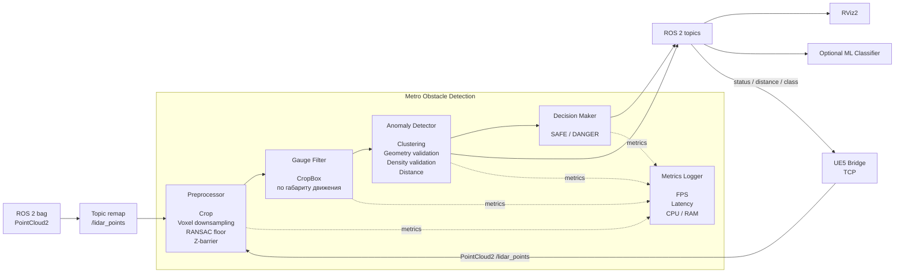
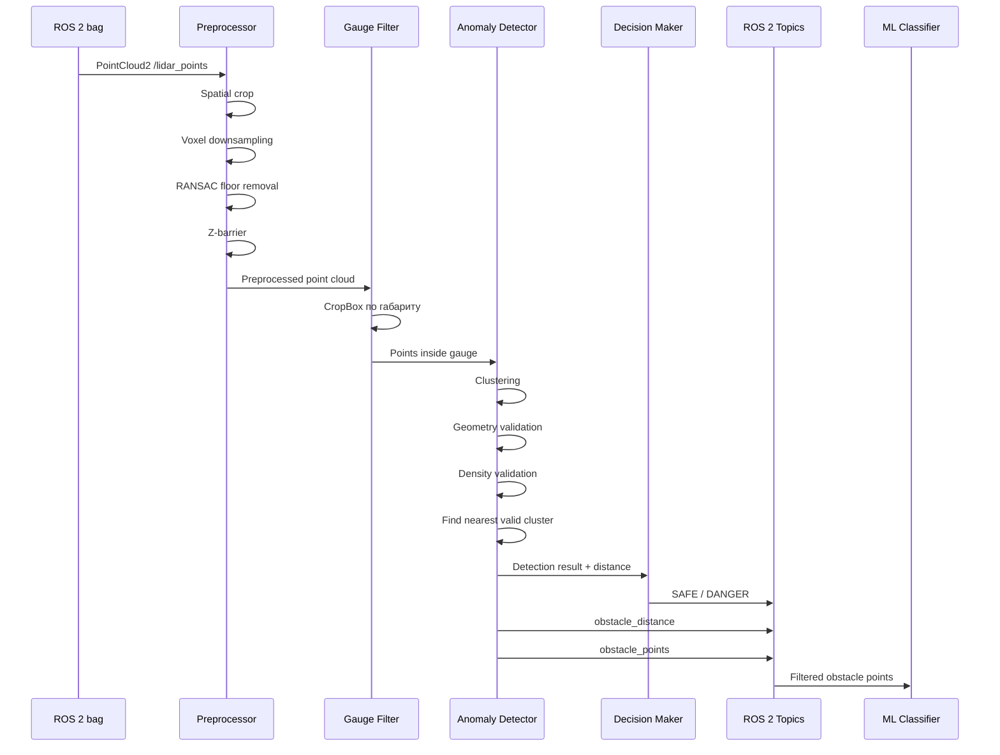
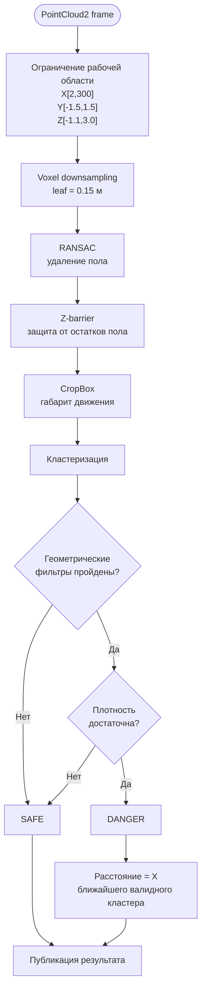
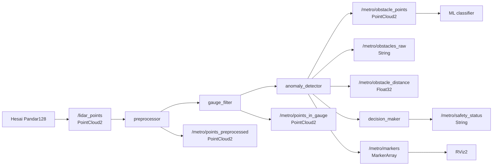

# Архитектура системы

Архитектура представлена в виде UML component diagram.



### Компоненты

| Компонент            | Ответственность                                                           |
| -------------------- | ------------------------------------------------------------------------- |
| `preprocessor`       | Ограничение рабочей области, voxel downsampling, удаление пола, Z-barrier |
| `gauge_filter`       | Фильтрация точек по габариту движения поезда                              |
| `anomaly_detector`   | Кластеризация и геометрическая валидация объектов                         |
| `cluster_cpu`        | CPU-реализация кластеризации                                              |
| `cluster_gpu`        | CUDA-реализация кластеризации                                             |
| `decision_maker`     | Формирование `SAFE / DANGER`                                              |
| `metrics_logger`     | Сбор FPS, latency, CPU и RAM                                              |
| `synthetic_scene.py` | Генерация тестовых сцен                                                   |
| `ue_bridge_node.py`  | Связка UE5 ↔ ROS 2 для тестирования и визуализации                       |
| `object_classifier_node.py` | Опциональная классификация обнаруженного объекта                 |
| RViz2                | Визуализация point cloud и результатов                                    |

---

# UML: последовательность обработки кадра

Следующая диаграмма показывает обработку одного входного кадра.



---

# UML: логика обнаружения препятствия



---

# Система координат

Используется правая декартова система координат LiDAR:

```text
          Z
          ↑
          │
          │
          └────────→ X
         /
        /
       Y

X → вперёд по направлению движения
Y → влево
Z → вверх
```

Лидар установлен на высоте:

```text
1.1 м от головки рельса
```

Поэтому уровень головки рельса в системе координат лидара:

```text
Z ≈ -1.1 м
```

Эта особенность учитывается при удалении пола и формировании рабочего диапазона по `Z`.

---

# Геометрическая модель

Для определения аномалий используется информация о геометрии тоннеля и габарите поезда.

Известные элементы:

```text
Пол
Рельсы
Стены
Кабели
Трубы
Конструктивные элементы
```

не должны считаться препятствиями.

После удаления известных элементов остаются потенциальные аномалии.

Если кластер находится внутри габарита движения и проходит геометрические проверки, он рассматривается как препятствие.

---

# Фильтрация рабочей области

Для уменьшения количества обрабатываемых точек используется пространственное ограничение:

```text
X ∈ [2, 300] м
Y ∈ [-1.5, 1.5] м
Z ∈ [-1.1, 3.0] м
```

### X

Минимальная дальность:

```text
2 м
```

Используется для исключения точек самого корпуса поезда и ближайшей области вокруг LiDAR.

Максимальная дальность:

```text
300 м
```

соответствует рабочей области алгоритма.

### Y

Используется поперечный габарит:

```text
[-1.5, 1.5] м
```

Это даёт запас относительно ширины поезда `2.7 м`.

### Z

Диапазон:

```text
[-1.1, 3.0] м
```

охватывает область от уровня головки рельса до верхней части потенциального препятствия.

---

# Voxel Downsampling

Исходное облако:

```text
307 200 points/frame
```

перед последующей обработкой уменьшается с помощью voxel grid.

Используется:

```text
voxel leaf = 0.15 м
```

Цель:

* уменьшить количество точек;
* ускорить кластеризацию;
* сохранить объекты размером от ~0.4 м;
* снизить вычислительную нагрузку GPU.

По экспериментам, downsampling даёт примерно **3× ускорение** без потери объектов целевого размера.

---

# Удаление пола

Для определения плоскости пола используется RANSAC.

Параметры:

```text
distance threshold = 0.15 м
iterations = 100
```

RANSAC удаляет основную плоскость пола, после чего применяется дополнительный Z-barrier.

Z-barrier необходим потому, что на больших расстояниях после RANSAC могут оставаться отдельные точки пола.

Без него остатки пола на дальности:

```text
D > 30 м
```

могли объединяться с точками препятствия в один кластер.

---

# Габарит движения

Для определения потенциального препятствия используется CropBox.

```text
X = [2, 300] м
Y = [-1.5, 1.5] м
Z = [-1.1, 3.0] м
```

Номинальная ширина поезда:

```text
2.7 м
```

Ширина колеи:

```text
1520 мм
```

Точки вне рабочей области не передаются в детектор аномалий.

---

# Кластеризация

После фильтрации выполняется пространственная кластеризация.

Поддерживаются:

```text
CPU → PCL
GPU → CUDA
```

Основной параметр:

```yaml
cluster_tolerance: 0.6
```

Точки, находящиеся ближе `0.6 м`, могут быть объединены в один кластер.

После кластеризации каждый кластер проходит независимую проверку.

---

# Геометрическая валидация

Для каждого кластера рассчитываются:

* высота;
* ширина;
* длина;
* количество точек;
* плотность;
* положение относительно габарита движения.

Используемые ограничения:

```text
min obstacle height = 0.15 м

max obstacle length = 5.0 м

max nominal width = 2.7 м

width rejection threshold = 4.2 м
```

### Почему 0.15 м

Низкие кластеры могут соответствовать:

* рельсам;
* шпалам;
* остаточным точкам пола.

Поэтому используется:

```text
min_obstacle_height = 0.15 м
```

---

# Фильтрация по ширине

Номинальный габарит поезда:

```text
2.7 м
```

Однако непосредственно около стены точки препятствия могут сливаться с точками тоннеля.

Поэтому используется отдельный порог отбраковки:

```text
4.2 м
```

Логика:

```text
width <= 4.2 м
    → кластер может быть валидным

width > 4.2 м
    → вероятный элемент тоннельной инфраструктуры
```

Предыдущий порог:

```text
3.5 м
```

давал нестабильность для препятствий, расположенных рядом со стеной.

---

# Адаптивная плотность

Количество точек, возвращаемых LiDAR для одного объекта, уменьшается с расстоянием.

Приближённо:

```text
N ∝ 1 / D²
```

Поэтому фиксированный `min_cluster_size` приводит к потере дальних объектов.

Используется адаптивный порог:

```text
required = max(6, 900 / D²)
```

где:

```text
D = distance to cluster
```

и:

```text
density_coefficient = 900
```

Это позволяет уменьшать требуемое количество точек по мере удаления объекта.

---

# Decision Making

После кластеризации формируется список валидных кластеров.

Если список пуст:

```text
SAFE
```

Если существует хотя бы один кластер, удовлетворяющий всем критериям:

```text
DANGER
```

Расстояние до препятствия:

```text
D = X_centroid
```

для ближайшего валидного кластера.

Иными словами:

```text
valid_clusters
      │
      ├── empty
      │     └── SAFE
      │
      └── non-empty
            └── DANGER
                  │
                  └── min(X_centroid)
```

---

# ROS 2 Interfaces

## Input

### `/lidar_points`

Тип:

```text
sensor_msgs/msg/PointCloud2
```

Назначение:

```text
Входное облако точек LiDAR.
```

Для старых bag-файлов используется remap:

```text
/sensing/lidar/hesai128/pointcloud
    ↓
/lidar_points
```

В `new_data` входной topic уже имеет имя:

```text
/lidar_points
```

---

## Internal / debug topics

### `/metro/points_preprocessed`

```text
sensor_msgs/msg/PointCloud2
```

Облако после:

* spatial crop;
* voxel downsampling;
* RANSAC;
* Z-barrier.

### `/metro/points_in_gauge`

```text
sensor_msgs/msg/PointCloud2
```

Точки после фильтрации по габариту движения.

---

## Detection topics

### `/metro/obstacles_raw`

```text
std_msgs/msg/String
```

Содержит:

* статус;
* количество найденных кластеров.

### `/metro/obstacle_distance`

```text
std_msgs/msg/Float32
```

Расстояние до ближайшего обнаруженного препятствия в метрах.

### `/metro/obstacle_points`

```text
sensor_msgs/msg/PointCloud2
```

Точки обнаруженного препятствия без фоновых объектов.

Этот topic используется как интерфейс между геометрическим детектором и ML-классификатором.

### `/metro/safety_status`

```text
std_msgs/msg/String
```

Возможные значения:

```text
SAFE
DANGER
```

### `/metro/markers`

```text
visualization_msgs/msg/MarkerArray
```

Маркеры для визуализации результатов в RViz2.

---

### `/metro/object_class`

Тип:

```text
std_msgs/msg/String
```

Опциональный результат отдельного ML-классификатора.

Формат:

```text
id:name:confidence
```

Например:

```text
4:obstacle:0.9821
```

---

## UE5 Bridge

Пакет `ue_bridge_pkg` использует отдельный TCP-протокол между UE5 и ROS 2.

UE5 передаёт кадры LiDAR в bridge, после чего они публикуются как обычный:

```text
/lidar_points
sensor_msgs/msg/PointCloud2
```

В обратную сторону bridge передаёт:

```text
SAFE / DANGER
distance
class_id
class_name
confidence
```

Такой интерфейс позволяет использовать UE5 как источник синтетического point cloud и одновременно показывать результат реального ROS 2-алгоритма в визуальной сцене.

---

# Полная схема ROS 2 интерфейсов



---

# Конфигурация

Основные параметры находятся в:

```text
ros2_ws/src/metro_obstacle_detection/config/params.yaml
```

Ключевые значения:

| Параметр                    |       Значение | Назначение                     |
| --------------------------- | -------------: | ------------------------------ |
| `cluster_tolerance`         |        `0.6 м` | Расстояние объединения точек   |
| `min_obstacle_height`       |       `0.15 м` | Минимальная высота кластера    |
| `max_obstacle_width`        |        `2.7 м` | Номинальная ширина             |
| `width rejection threshold` |        `4.2 м` | Отбраковка широких кластеров   |
| `max_obstacle_length`       |        `5.0 м` | Максимальная длина             |
| `density_coefficient`       |          `900` | Коэффициент адаптивного порога |
| `voxel leaf`                |       `0.15 м` | Размер voxel                   |
| RANSAC threshold            |       `0.15 м` | Допуск плоскости               |
| RANSAC iterations           |          `100` | Число итераций                 |
| CropBox X                   |    `[2,300] м` | Дальность                      |
| CropBox Y                   | `[-1.5,1.5] м` | Поперечный диапазон            |
| CropBox Z                   | `[-1.1,3.0] м` | Вертикальный диапазон          |

Параметры могут изменяться через ROS 2 parameters без пересборки проекта.

---

# Сборка

Проект использует Docker.

Базовое окружение:

```text
ROS 2 Humble
CUDA 12.4.1
C++17
```

## CPU

```bash
docker build \
  -t metro_obstacle:cpu \
  ros2_ws/ \
  --build-arg USE_CUDA=OFF
```

## GPU

```bash
docker build \
  -t metro_obstacle:gpu \
  ros2_ws/ \
  --build-arg USE_CUDA=ON
```

---

# Запуск

## ROS 2 bag

```bash
./ros2_ws/run.sh run data/for_hackathon/doubleT_obstacle
```

Ограничение времени выполнения:

```bash
./ros2_ws/run.sh run data/new_data --duration 60
```

`run.sh` автоматически выполняет необходимый remap для старых bag-файлов.

---

## Демонстрация

[Архив проекта и материалы демонстрации на Google Drive](https://drive.google.com/drive/folders/1B3atd5QJvvHEFeWFFKoKJlb-78TLQSwz)

На диске по ссылке находятся:

* видео работы алгоритма обнаружения препятствий;
* видео визуализации работы системы в **Unreal Engine 5 (UE5)**;
* готовое приложение **`.exe`** для запуска UE5-визуализации;
* дополнительные материалы демонстрации проекта.

UE5-визуализация подключается к ROS 2 через `ue_bridge_pkg`: синтетический или процедурно сформированный point cloud передаётся в основной pipeline, а результат детекции возвращается в визуальную сцену.

# Тестирование

Полный прогон шести dev-бэгов:

```bash
./ros2_ws/run.sh test
```

---

# Синтетические данные

Генератор:

```text
ros2_ws/scripts/synthetic_scene.py
```

Сцена с препятствием:

```bash
./ros2_ws/run.sh synthetic \
  --distance 100 \
  --size 1.5
```

Симуляция движения поезда:

```bash
./ros2_ws/run.sh synthetic \
  --distance 120 \
  --speed 10
```

Генератор моделирует:

* рельсы;
* шпалы;
* элементы тоннеля;
* кабели;
* препятствие;
* движение относительно препятствия.

---

# RViz2

Запуск визуализации:

```bash
./ros2_ws/run.sh rviz data/new_data
```

Конфигурация:

```text
ros2_ws/src/metro_obstacle_detection/config/rviz2_config.rviz
```

В RViz2 доступны:

* исходные точки;
* обработанные точки;
* точки внутри габарита;
* точки препятствия;
* маркеры;
* положение и расстояние до обнаруженного объекта.

---

# Benchmark

Запуск:

```bash
./ros2_ws/benchmark.sh doubleT_obstacle
```

Результаты:

```text
bench_results/
```

Измеряются:

```text
FPS
latency
CPU
RAM
```

---

# Запуск
./ros2_ws/run.sh run data/for_hackathon/doubleT_obstacle

# RViz2
./ros2_ws/run.sh rviz data/for_hackathon/doubleT_obstacle

# Benchmark
./ros2_ws/benchmark.sh doubleT_obstacle
```

Основные результаты можно проверить через:

```text
SAFE / DANGER
/metro/*
```

---

# Эксперименты

## Фактически проверенный запуск

На текущей версии проекта выполнен реальный запуск Docker + ROS 2 + ROS 2 bag на сценарии `doubleT_obstacle`.

Команда:

```bash
./ros2_ws/run.sh run data/for_hackathon/doubleT_obstacle --duration 30
```

Результат запуска:

| Параметр | Результат |
|---|---|
| Docker image | `metro_obstacle:dev` |
| CUDA | `12.4.1` |
| Режим detector | GPU acceleration |
| ROS 2 bag | `doubleT_obstacle_0.db3` |
| Сценарий | `doubleT_obstacle` |
| ROS 2 bag rate | `1.0` |
| Обнаружение препятствия | Да |
| Выходной статус | `DANGER: obstacle_detected` |
| Наблюдаемая дистанция в обнаружениях | `6.1–6.4 м` |
| Число кластеров в обнаружениях | `2–4` |
| Завершение процессов | штатное, `process has finished cleanly` |

Detector в ходе запуска выдавал сообщения вида:

```text
DETECTED: 2 clusters, min_dist=6.3 m
Safety status: DANGER: obstacle_detected (clusters: 2, distance: 6.3 m)
```

Периодическая статистика detector за время запуска:

```text
Stats: frames=28, detections=67
Stats: frames=46, detections=115
Stats: frames=35, detections=91
```

Эти значения являются промежуточными интервалами статистики detector и не должны интерпретироваться как полный итоговый FPS или как точная полнота обнаружения по всему bag.


# Ограничения

Текущая версия имеет следующие ограничения:

1. GPU-кластеризация плохо масштабируется при большом количестве точек.
2. Рабочая дальность ограничена `300 м`.
3. Детекция выполняется покадрово.
4. Межкадровый tracking пока не реализован.
5. Семантическая классификация объекта не входит в геометрический детектор.
6. Оценка габаритов препятствия находится в разработке.
7. Для классификации типа объекта используется отдельный ML-модуль.

---

# Интеграция с ML-классификатором

Геометрический детектор публикует:

```text
/metro/obstacle_points
```

Тип:

```text
sensor_msgs/msg/PointCloud2
```

Пайплайн:

```text
LiDAR
  │
  ▼
Geometry detector
  │
  │ obstacle_points
  ▼
ML classifier
  │
  ▼
Object class
```

ML-классификатор получает только точки обнаруженного объекта.

Фон тоннеля предварительно удалён.

Это позволяет отделить:

```text
обнаружение факта препятствия
```

от:

```text
классификации типа препятствия
```

Например:

```text
Geometry detector
    ↓
DANGER
    ↓
Obstacle point cloud
    ↓
ML
    ↓
semantic class
```

---

# Структура репозитория

```text
olimpiada_ltc/
│
├── data/
│   └── # ROS 2 bags, не коммитятся в Git
│
├── docs/
│   ├── BLENDER_INTEGRATION.md
│   └── experiments/
│       └── log.md
│
├── ros2_ws/
│   ├── Dockerfile
│   ├── run.sh
│   ├── benchmark.sh
│   ├── scripts/
│   │   └── synthetic_scene.py
│   └── src/
│       ├── metro_obstacle_detection/
│       │   ├── src/
│       │   │   ├── preprocessor.cpp
│       │   │   ├── gauge_filter.cpp
│       │   │   ├── anomaly_detector.cpp
│       │   │   ├── cluster_cpu.cpp
│       │   │   ├── cluster_gpu.cpp
│       │   │   ├── cluster_gpu_kernels.cu
│       │   │   ├── decision_maker.cpp
│       │   │   └── metrics_logger.cpp
│       │   ├── include/
│       │   │   └── types.hpp
│       │   ├── config/
│       │   │   ├── params.yaml
│       │   │   ├── rviz2_config.rviz
│       │   │   └── demo.rviz
│       │   └── launch/
│       └── ue_bridge_pkg/
│           └── ue_bridge_pkg/
│               ├── ue_bridge_node.py
│               └── object_classifier_node.py
│
└── README.md
```

---

# Соответствие ТЗ

Проверка выполнена по текущему исходному коду, Docker-конфигурации, README и требованиям ТЗ из документа «Система обнаружения посторонних объектов для беспилотных поездов в тоннеле метро по данным 3D-лидара».

| Требование ТЗ | Статус | Что есть в проекте |
|---|---|---|
| Обнаружение потенциального препятствия | ✅ | Геометрический детектор, `SAFE / DANGER`, `/metro/obstacles_raw`, `/metro/safety_status` |
| Расстояние до ближайшего препятствия | ✅ | `/metro/obstacle_distance`, вычисление минимальной дистанции |
| Обработка ROS 2 PointCloud2 | ✅ | `/lidar_points` и последовательный ROS 2 pipeline |
| Docker | ✅ | `ros2_ws/Dockerfile`, `build.sh`, `run.sh` |
| ROS 2 Humble / Ubuntu 22.04 | ✅ | Зафиксированы в Dockerfile и README |
| Чтение и проигрывание ROS 2 bag | ✅ | `ros2 bag play` через `run.sh`, автоматический remap старого топика |
| Результат работы алгоритма | ✅ | ROS 2 topics, логи, RViz2, SAFE/DANGER |
| Демонстрация через визуализацию | ✅ | RViz2 + интеграция с UE5 через `ue_bridge_pkg` |
| README с инструкциями | ✅ | Сборка, запуск, bag, параметры, архитектура, алгоритм, эксперименты |
| Архитектура и описание алгоритма | ✅ | Отдельные разделы с pipeline, фильтрацией, кластеризацией и decision making |
| Эксперименты | ✅ | Dev-bag тесты, синтетические дистанции, FPS и latency |
| Короткое видео работы | ⚠️ | В README указан Google Drive с видео; наличие и содержание внешних файлов нельзя проверить из репозитория |

# Команда

**DeepConv**

Мейнтейнеры:

- vlaimir_vinogradov
- albert_sharafiev
- timofey_kudakov

Контакт:

```text
vv299907@xmail.ru
```

