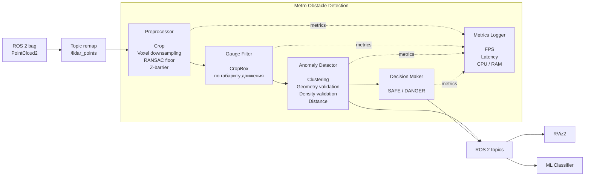
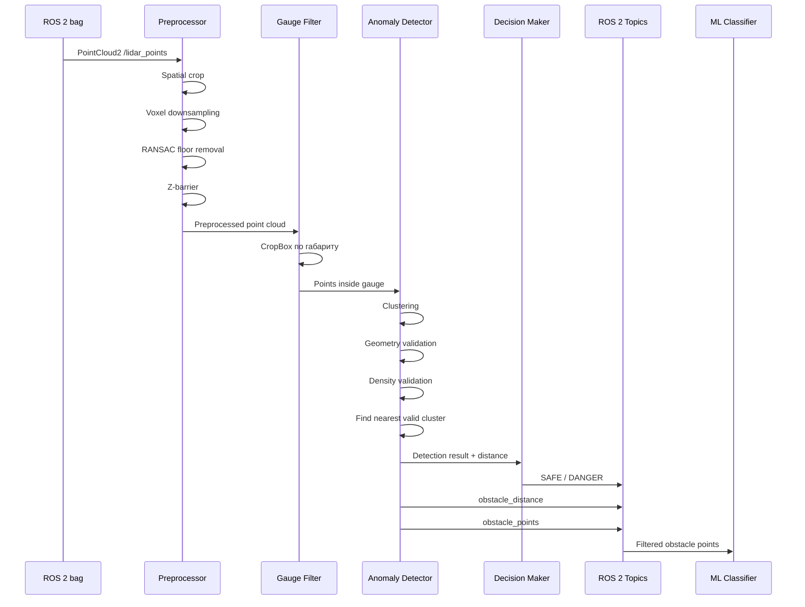
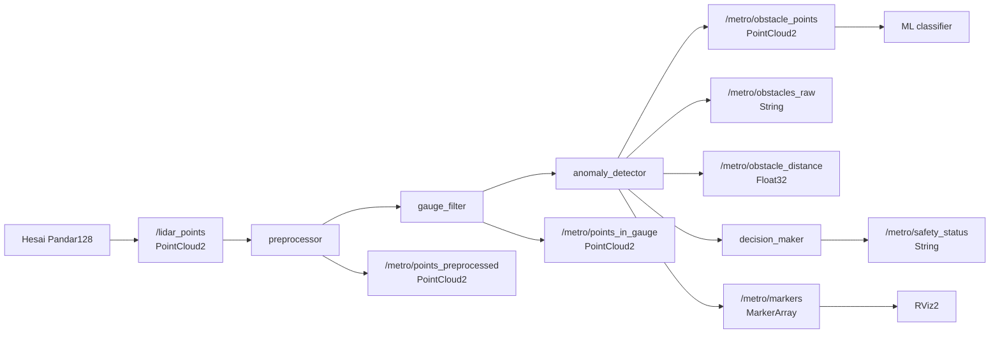

# Metro Obstacle Detection

Геометрическая система обнаружения посторонних объектов в тоннеле метро для автономного поезда.

Проект команды **DeepConv** для кейса Департамента транспорта Москвы.

Система получает 3D point cloud от лидара **Hesai Pandar128**, удаляет известные элементы тоннельной инфраструктуры, выделяет аномальные кластеры внутри габарита движения поезда и определяет наличие препятствия.

Основной принцип работы — **геометрическая детекция без обучения на размеченных примерах**.

Вместо классификации объекта система строит модель нормального тоннеля:

* пол;
* рельсы;
* стены;
* кабели и коммуникации;
* область движения поезда.

Кластер точек считается препятствием, если он не соответствует этой геометрической модели, находится в габарите движения и проходит набор проверок по размеру и плотности.

---

## Основные характеристики

| Параметр          |        Значение |
| ----------------- | --------------: |
| LiDAR             | Hesai Pandar128 |
| Точек на кадр     |         307 200 |
| Частота LiDAR     |           10 Гц |
| Рабочая дальность |         2–300 м |
| Размер voxel      |          0.15 м |
| Габарит поезда    |           2.7 м |
| Колея             |         1520 мм |
| ROS               |    ROS 2 Humble |
| Язык              |           C++17 |
| GPU               |     CUDA 12.4.1 |
| CPU clustering    |             PCL |
| GPU clustering    |            CUDA |
| Выходной статус   | `SAFE / DANGER` |

---

# Архитектура системы

Архитектура представлена в виде UML component diagram.



### Компоненты

| Компонент            | Ответственность                                                           |
| -------------------- | ------------------------------------------------------------------------- |
| `preprocessor`       | Ограничение рабочей области, voxel downsampling, удаление пола, Z-barrier |
| `gauge_filter`       | Фильтрация точек по габариту движения поезда                              |
| `anomaly_detector`   | Кластеризация и геометрическая валидация объектов                         |
| `cluster_cpu`        | CPU-реализация кластеризации                                              |
| `cluster_gpu`        | CUDA-реализация кластеризации                                             |
| `decision_maker`     | Формирование `SAFE / DANGER`                                              |
| `metrics_logger`     | Сбор FPS, latency, CPU и RAM                                              |
| `synthetic_scene.py` | Генерация тестовых сцен                                                   |
| RViz2                | Визуализация point cloud и результатов                                    |

---

# UML: последовательность обработки кадра

Следующая диаграмма показывает обработку одного входного кадра.



---

# UML: логика обнаружения препятствия


---

# Система координат

Используется правая декартова система координат LiDAR:

```text
          Z
          ↑
          │
          │
          └────────→ X
         /
        /
       Y

X → вперёд по направлению движения
Y → влево
Z → вверх
```

Лидар установлен на высоте:

```text
1.1 м от головки рельса
```

Поэтому уровень головки рельса в системе координат лидара:

```text
Z ≈ -1.1 м
```

Эта особенность учитывается при удалении пола и формировании рабочего диапазона по `Z`.

---

# Геометрическая модель

Для определения аномалий используется информация о геометрии тоннеля и габарите поезда.

Известные элементы:

```text
Пол
Рельсы
Стены
Кабели
Трубы
Конструктивные элементы
```

не должны считаться препятствиями.

После удаления известных элементов остаются потенциальные аномалии.

Если кластер находится внутри габарита движения и проходит геометрические проверки, он рассматривается как препятствие.

---

# Фильтрация рабочей области

Для уменьшения количества обрабатываемых точек используется пространственное ограничение:

```text
X ∈ [2, 300] м
Y ∈ [-1.5, 1.5] м
Z ∈ [-1.1, 3.0] м
```

### X

Минимальная дальность:

```text
2 м
```

Используется для исключения точек самого корпуса поезда и ближайшей области вокруг LiDAR.

Максимальная дальность:

```text
300 м
```

соответствует рабочей области алгоритма.

### Y

Используется поперечный габарит:

```text
[-1.5, 1.5] м
```

Это даёт запас относительно ширины поезда `2.7 м`.

### Z

Диапазон:

```text
[-1.1, 3.0] м
```

охватывает область от уровня головки рельса до верхней части потенциального препятствия.

---

# Voxel Downsampling

Исходное облако:

```text
307 200 points/frame
```

перед последующей обработкой уменьшается с помощью voxel grid.

Используется:

```text
voxel leaf = 0.15 м
```

Цель:

* уменьшить количество точек;
* ускорить кластеризацию;
* сохранить объекты размером от ~0.4 м;
* снизить вычислительную нагрузку GPU.

По экспериментам, downsampling даёт примерно **3× ускорение** без потери объектов целевого размера.

---

# Удаление пола

Для определения плоскости пола используется RANSAC.

Параметры:

```text
distance threshold = 0.15 м
iterations = 100
```

RANSAC удаляет основную плоскость пола, после чего применяется дополнительный Z-barrier.

Z-barrier необходим потому, что на больших расстояниях после RANSAC могут оставаться отдельные точки пола.

Без него остатки пола на дальности:

```text
D > 30 м
```

могли объединяться с точками препятствия в один кластер.

---

# Габарит движения

Для определения потенциального препятствия используется CropBox.

```text
X = [2, 300] м
Y = [-1.5, 1.5] м
Z = [-1.1, 3.0] м
```

Номинальная ширина поезда:

```text
2.7 м
```

Ширина колеи:

```text
1520 мм
```

Точки вне рабочей области не передаются в детектор аномалий.

---

# Кластеризация

После фильтрации выполняется пространственная кластеризация.

Поддерживаются:

```text
CPU → PCL
GPU → CUDA
```

Основной параметр:

```yaml
cluster_tolerance: 0.6
```

Точки, находящиеся ближе `0.6 м`, могут быть объединены в один кластер.

После кластеризации каждый кластер проходит независимую проверку.

---

# Геометрическая валидация

Для каждого кластера рассчитываются:

* высота;
* ширина;
* длина;
* количество точек;
* плотность;
* положение относительно габарита движения.

Используемые ограничения:

```text
min obstacle height = 0.15 м

max obstacle length = 5.0 м

max nominal width = 2.7 м

width rejection threshold = 4.2 м
```

### Почему 0.15 м

Низкие кластеры могут соответствовать:

* рельсам;
* шпалам;
* остаточным точкам пола.

Поэтому используется:

```text
min_obstacle_height = 0.15 м
```

---

# Фильтрация по ширине

Номинальный габарит поезда:

```text
2.7 м
```

Однако непосредственно около стены точки препятствия могут сливаться с точками тоннеля.

Поэтому используется отдельный порог отбраковки:

```text
4.2 м
```

Логика:

```text
width <= 4.2 м
    → кластер может быть валидным

width > 4.2 м
    → вероятный элемент тоннельной инфраструктуры
```

Предыдущий порог:

```text
3.5 м
```

давал нестабильность для препятствий, расположенных рядом со стеной.

---

# Адаптивная плотность

Количество точек, возвращаемых LiDAR для одного объекта, уменьшается с расстоянием.

Приближённо:

```text
N ∝ 1 / D²
```

Поэтому фиксированный `min_cluster_size` приводит к потере дальних объектов.

Используется адаптивный порог:

```text
required = max(6, 900 / D²)
```

где:

```text
D = distance to cluster
```

и:

```text
density_coefficient = 900
```

Это позволяет уменьшать требуемое количество точек по мере удаления объекта.

---

# Decision Making

После кластеризации формируется список валидных кластеров.

Если список пуст:

```text
SAFE
```

Если существует хотя бы один кластер, удовлетворяющий всем критериям:

```text
DANGER
```

Расстояние до препятствия:

```text
D = X_centroid
```

для ближайшего валидного кластера.

Иными словами:

```text
valid_clusters
      │
      ├── empty
      │     └── SAFE
      │
      └── non-empty
            └── DANGER
                  │
                  └── min(X_centroid)
```

---

# ROS 2 Interfaces

## Input

### `/lidar_points`

Тип:

```text
sensor_msgs/msg/PointCloud2
```

Назначение:

```text
Входное облако точек LiDAR.
```

Для старых bag-файлов используется remap:

```text
/sensing/lidar/hesai128/pointcloud
    ↓
/lidar_points
```

В `new_data` входной topic уже имеет имя:

```text
/lidar_points
```

---

## Internal / debug topics

### `/metro/points_preprocessed`

```text
sensor_msgs/msg/PointCloud2
```

Облако после:

* spatial crop;
* voxel downsampling;
* RANSAC;
* Z-barrier.

### `/metro/points_in_gauge`

```text
sensor_msgs/msg/PointCloud2
```

Точки после фильтрации по габариту движения.

---

## Detection topics

### `/metro/obstacles_raw`

```text
std_msgs/msg/String
```

Содержит:

* статус;
* количество найденных кластеров.

### `/metro/obstacle_distance`

```text
std_msgs/msg/Float32
```

Расстояние до ближайшего обнаруженного препятствия в метрах.

### `/metro/obstacle_points`

```text
sensor_msgs/msg/PointCloud2
```

Точки обнаруженного препятствия без фоновых объектов.

Этот topic используется как интерфейс между геометрическим детектором и ML-классификатором.

### `/metro/safety_status`

```text
std_msgs/msg/String
```

Возможные значения:

```text
SAFE
DANGER
```

### `/metro/markers`

```text
visualization_msgs/msg/MarkerArray
```

Маркеры для визуализации результатов в RViz2.

---

# Полная схема ROS 2 интерфейсов



---

# Конфигурация

Основные параметры находятся в:

```text
ros2_ws/src/metro_obstacle_detection/config/params.yaml
```

Ключевые значения:

| Параметр                    |       Значение | Назначение                     |
| --------------------------- | -------------: | ------------------------------ |
| `cluster_tolerance`         |        `0.6 м` | Расстояние объединения точек   |
| `min_obstacle_height`       |       `0.15 м` | Минимальная высота кластера    |
| `max_obstacle_width`        |        `2.7 м` | Номинальная ширина             |
| `width rejection threshold` |        `4.2 м` | Отбраковка широких кластеров   |
| `max_obstacle_length`       |        `5.0 м` | Максимальная длина             |
| `density_coefficient`       |          `900` | Коэффициент адаптивного порога |
| `voxel leaf`                |       `0.15 м` | Размер voxel                   |
| RANSAC threshold            |       `0.15 м` | Допуск плоскости               |
| RANSAC iterations           |          `100` | Число итераций                 |
| CropBox X                   |    `[2,300] м` | Дальность                      |
| CropBox Y                   | `[-1.5,1.5] м` | Поперечный диапазон            |
| CropBox Z                   | `[-1.1,3.0] м` | Вертикальный диапазон          |

Параметры могут изменяться через ROS 2 parameters без пересборки проекта.

---

# Сборка

Проект использует Docker.

Базовое окружение:

```text
ROS 2 Humble
CUDA 12.4.1
C++17
```

## CPU

```bash
docker build \
  -t metro_obstacle:dev \
  ros2_ws/
```

## GPU

```bash
docker build \
  -t metro_obstacle:gpu \
  ros2_ws/ \
  --build-arg USE_CUDA=ON
```

---

# Запуск

## ROS 2 bag

```bash
./ros2_ws/run.sh run data/for_hackathon/doubleT_obstacle
```

Ограничение времени выполнения:

```bash
./ros2_ws/run.sh run data/new_data --duration 60
```

`run.sh` автоматически выполняет необходимый remap для старых bag-файлов.

---

# Тестирование

Полный прогон шести dev-бэгов:

```bash
./ros2_ws/run.sh test
```

---

# Синтетические данные

Генератор:

```text
ros2_ws/scripts/synthetic_scene.py
```

Сцена с препятствием:

```bash
./ros2_ws/run.sh synthetic \
  --distance 100 \
  --size 1.5
```

Симуляция движения поезда:

```bash
./ros2_ws/run.sh synthetic \
  --distance 120 \
  --speed 10
```

Генератор моделирует:

* рельсы;
* шпалы;
* элементы тоннеля;
* кабели;
* препятствие;
* движение относительно препятствия.

---

# RViz2

Запуск визуализации:

```bash
./ros2_ws/run.sh rviz data/new_data
```

Конфигурация:

```text
ros2_ws/src/metro_obstacle_detection/config/rviz2_config.rviz
```

В RViz2 доступны:

* исходные точки;
* обработанные точки;
* точки внутри габарита;
* точки препятствия;
* маркеры;
* положение и расстояние до обнаруженного объекта.

---

# Benchmark

Запуск:

```bash
./ros2_ws/benchmark.sh doubleT_obstacle
```

Результаты:

```text
bench_results/
```

Измеряются:

```text
FPS
latency
CPU
RAM
```

---

# Быстрый старт

```bash
# Сборка
docker build -t metro_obstacle:dev ros2_ws/

# Запуск
./ros2_ws/run.sh run data/for_hackathon/doubleT_obstacle

# Тесты
./ros2_ws/run.sh test

# RViz2
./ros2_ws/run.sh rviz data/for_hackathon/doubleT_obstacle

# Benchmark
./ros2_ws/benchmark.sh doubleT_obstacle
```

Основные результаты можно проверить через:

```text
SAFE / DANGER
/metro/*
```

---

# Эксперименты

| Эксперимент               | Результат                  |
| ------------------------- | -------------------------- |
| 6 dev-бэгов, 2270 кадров  | 0 ложных срабатываний      |
| `doubleT_obstacle`        | 100% кадров с препятствием |
| `doubleT_obstacle`        | `D = 6.0–6.1 м`            |
| `doubleT_obstacle`        | Статус без мигания         |
| Синтетика, 50 м           | 50.4 м                     |
| Синтетика, 100 м          | 100.6 м                    |
| Синтетика, 200 м          | 199.1 м                    |
| Пустой тоннель, 300 м     | 0 детекций                 |
| Сближение, 120 м @ 10 м/с | 110 → 5 м без потерь       |
| `new_data`, ~20 мин       | Стабильная обработка       |
| RTX 4060 Mobile           | ~7.6 FPS при входе 10 Гц   |
| RTX 4060 Mobile           | ~120 мс latency            |

---

# Анализ отклонённых гипотез

## RANSAC без Z-barrier

### Наблюдение

После удаления плоскости пола на дальних расстояниях оставались отдельные точки.

При:

```text
D > 30 м
```

они могли объединяться с точками препятствия.

### Последствие

Один кластер мог содержать одновременно:

```text
остатки пола + препятствие
```

что приводило к некорректной геометрии кластера и пропускам.

### Решение

Добавлен Z-barrier.

---

## Фиксированный `min_cluster_size`

### Наблюдение

На больших расстояниях количество точек от объекта уменьшается.

При:

```text
D > 50 м
```

объект мог содержать менее 30 точек.

### Последствие

Фиксированный threshold приводил к пропускам дальних объектов.

### Решение

Использован адаптивный threshold:

```text
required = max(6, 900 / D²)
```

---

## Порог ширины 3.5 м

### Наблюдение

При расположении препятствия рядом со стеной точки объекта могли объединяться с пристеночными точками.

Размер кластера достигал примерно:

```text
4 м
```

### Последствие

Порог `3.5 м` приводил к нестабильному результату:

```text
SAFE → DANGER → SAFE
```

### Решение

Порог отбраковки увеличен до:

```text
4.2 м
```

---

# Производительность

На тестовой системе:

```text
GPU: RTX 4060 Mobile
Input: 10 Hz
Processing: ~7.6 FPS
Latency: ~120 ms
```

GPU-кластеризация имеет вычислительную сложность, близкую к:

```text
O(n²)
```

по количеству точек.

Поэтому после предварительной фильтрации практическая рабочая область составляет порядка:

```text
10⁴ points
```

---

# Ограничения

Текущая версия имеет следующие ограничения:

1. GPU-кластеризация плохо масштабируется при большом количестве точек.
2. Рабочая дальность ограничена `300 м`.
3. Детекция выполняется покадрово.
4. Межкадровый tracking пока не реализован.
5. Семантическая классификация объекта не входит в геометрический детектор.
6. Оценка габаритов препятствия находится в разработке.
7. Для классификации типа объекта используется отдельный ML-модуль.

---

# Интеграция с ML-классификатором

Геометрический детектор публикует:

```text
/metro/obstacle_points
```

Тип:

```text
sensor_msgs/msg/PointCloud2
```

Пайплайн:

```text
LiDAR
  │
  ▼
Geometry detector
  │
  │ obstacle_points
  ▼
ML classifier
  │
  ▼
Object class
```

ML-классификатор получает только точки обнаруженного объекта.

Фон тоннеля предварительно удалён.

Это позволяет отделить:

```text
обнаружение факта препятствия
```

от:

```text
классификации типа препятствия
```

Например:

```text
Geometry detector
    ↓
DANGER
    ↓
Obstacle point cloud
    ↓
ML
    ↓
semantic class
```

---

# Интеграция с Blender

Документация:

```text
docs/BLENDER_INTEGRATION.md
```

Документ содержит:

* систему координат;
* формат `PointCloud2`;
* соответствие координат Blender ↔ ROS 2;
* пример publisher;
* параметры сцены.

Система координат:

```text
X → вперёд
Y → влево
Z → вверх
```

Origin:

```text
LiDAR на высоте 1.1 м от головки рельса
```

---

# Структура репозитория

```text
olimpiada_ltc/
│
├── data/
│   └── # ROS 2 bags, не коммитятся в Git
│
├── docs/
│   ├── BLENDER_INTEGRATION.md
│   └── experiments/
│       └── log.md
│
├── ros2_ws/
│   │
│   ├── Dockerfile
│   ├── run.sh
│   ├── benchmark.sh
│   │
│   ├── scripts/
│   │   └── synthetic_scene.py
│   │
│   └── src/
│       └── metro_obstacle_detection/
│           │
│           ├── src/
│           │   ├── preprocessor
│           │   ├── gauge_filter
│           │   ├── anomaly_detector
│           │   ├── cluster_cpu
│           │   ├── cluster_gpu
│           │   ├── decision_maker
│           │   └── metrics_logger
│           │
│           ├── include/
│           │   └── types.hpp
│           │
│           ├── config/
│           │   ├── params.yaml
│           │   └── rviz2_config.rviz
│           │
│           └── launch/
│
└── README.md
```

---

# Соглашения разработки

## Git branches

```text
main
dev
feat/*
fix/*
```

Назначение:

* `main` — стабильная версия;
* `dev` — текущая разработка;
* `feat/*` — новые возможности;
* `fix/*` — исправления.

---

## Commit convention

Используется **Conventional Commits**.

Примеры:

```text
feat: add adaptive density threshold
fix: prevent wall points from merging with obstacle
perf: optimize GPU clustering
docs: update benchmark results
refactor: split detector pipeline
```

---

## C++

Используется:

```text
C++17
```

Основные соглашения:

* ROS 2 / Google C++ style;
* константы — `kPascalCase`;
* поля классов — `snake_case_`;
* память управляется через smart pointers;
* ROS 2 parameters объявляются через `declare_parameter`.

---

## Эксперименты

Результаты экспериментов фиксируются в:

```text
docs/experiments/log.md
```

Запись результата выполняется **до коммита изменения алгоритма**.

Файлы размером более:

```text
10 MB
```

не добавляются в Git.

---

# Текущий статус

## Готово

* [x] Основной ROS 2 pipeline
* [x] Обработка Hesai Pandar128
* [x] Spatial filtering
* [x] Voxel downsampling
* [x] RANSAC floor removal
* [x] Z-barrier
* [x] Gauge filtering
* [x] CPU clustering
* [x] CUDA clustering
* [x] Геометрическая валидация
* [x] Адаптивный density threshold
* [x] Определение расстояния до препятствия
* [x] `SAFE / DANGER`
* [x] ROS 2 integration topics
* [x] RViz2 visualization
* [x] Синтетический генератор
* [x] Benchmark tooling
* [x] Docker environment
* [x] Blender integration documentation
* [x] ML integration interface

## В работе

* [ ] Видео работы алгоритма согласно ТЗ, п. 5
* [ ] Межкадровый tracking
* [ ] Оценка габаритов препятствия

---

# Команда

**DeepConv**

Мейнтейнер:

```text
vlaimir_vinogradov
```

Контакт:

```text
vv299907@xmail.ru
```

---

# License

Лицензия проекта не указана.
